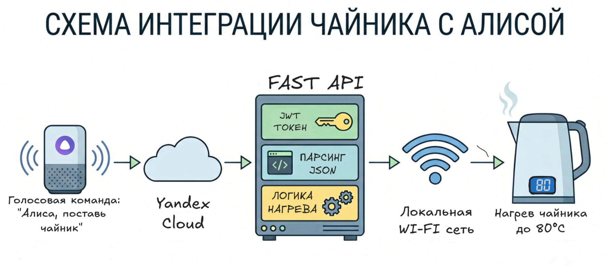

<h1 align="center">Smart Kettle API 🫖</h1>


> Локальный мост для интеграции чайника Xiaomi Kettle 2 Pro (CN) в умный дом Яндекса (Алису)


---
## 🎯 Решаемая проблема
Чайник привязан к китайскому региону Mi Home, из-за этого Алиса его не видит. Проект подключает его напрямую:
* **Прямое управление** устройством без задержек
* **Независимость** от китайских серверов

## 🏗 Архитектура проекта


## 📦 Возможности

- Чайник добавляется в Алису как полноценное устройство: вкл/выкл, установка температуры
- Работает напрямую без китайского облака - задержек нет и чужие серверы не участвуют
- Время нагрева рассчитывается по текущей и целевой температуре
- Тихий режим: с 23:00 до 11:00 утра (границы в `.env`) чайник не издает звуков при нагреве
- Свой OAuth2-сервер: Яндекс выступает клиентом, который получает одноразовый код (TTL 3 минуты) и ходит на эндпоинты (Discovery/Query/Action) с JWT-токеном, без валидного токена - 401
- Резервное управление через Telegram-бота (aiogram 3): бот показывает примерное время до нагрева; может быть настроен доступ только у админов в .env (`ADMIN_ID`); возможность работы через прокси для обхода блокировок
- Swagger закрыт HTTP Basic Auth
- Логи пишутся в отдельные файлы `api.log` и `bot.log` (логи Uvicorn перехватываются и ротируются через Loguru)

## 🛠 Стек
*   **Backend:** Python 3.11, FastAPI, Pydantic
*   **Telegram Bot:** Aiogram 3
*   **IoT Protocol:** python-miio
*   **Security:** PyJWT, secrets
*   **Logging:** Loguru

## 🚀 Быстрый старт

```bash
# 1. Клонируем репозиторий
git clone https://github.com/MySelfZalin/smart-kettle-api.git
cd smart-kettle-api

# 2. Окружение и зависимости
python3.11 -m venv .venv && source .venv/bin/activate
pip install -r requirements.txt

# 3. Конфиг из шаблона - токены Mi, ADMIN_ID, прокси
cp .env.example .env

# 4. Запускаем (в двух терминалах или через tmux)
python -m fast_api.main   # API
python -m tg_bot.bot      # Telegram
```

## 🚧 Roadmap

В ближайших планах по развитию:

* [ ] **Перенос OAuth-кодов в Redis:** Сейчас одноразовые коды хранятся в памяти (сбрасываются при перезапуске). Планируется хранение сессий в **Redis**.
* [ ] **Графики в Telegram:** Команда `/graphics` уже заявлена в боте, но сама отрисовка графиков ещё в разработке.
* [ ] **Сбор метрик и дашборды:** Подключение **InfluxDB** для хранения данных о температуре воды и вывод красивых графиков остывания/нагрева в **Grafana**.
* [ ] **Docker:** Упаковка всего в Docker для поднятия всего (API, Bot, Redis, Influx) одной командой.
